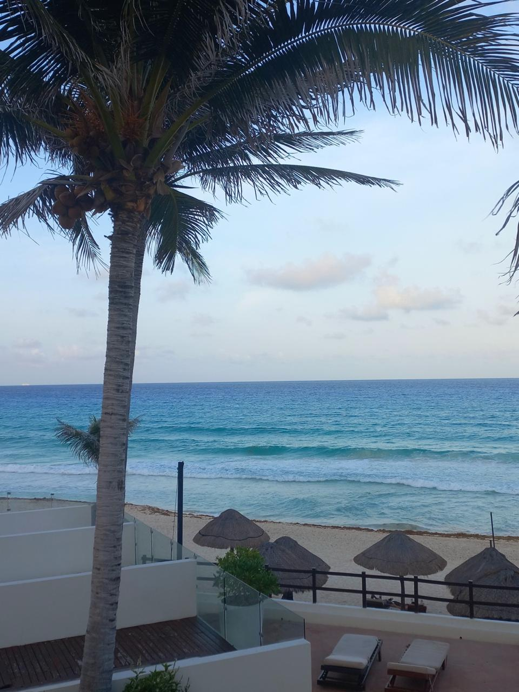
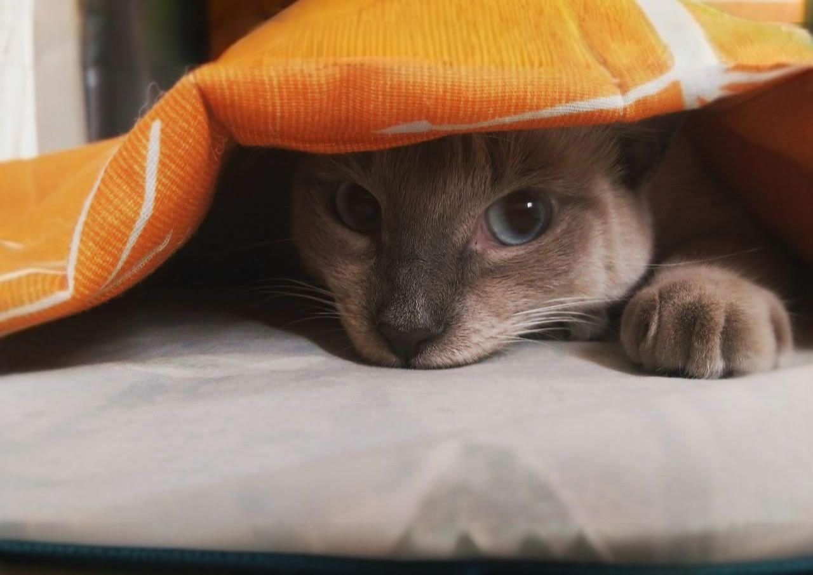

# Presentación Personal

Me llamo Laura Bonnet, tengo 17 años y estudio Producción Audiovisual Interactiva, estoy en segundo semestre,
en este curso me gustaría aprender nuevas habilidades con el código y la programación.

## Mis habilidades
| Fotografía | Edición de fotos | Programación |
|------------|------------------|--------------|
| Nivel **alto** | Nivel **medio** | Nivel **bajo** |

---

## Mi lugar favorito
Uno de mis lugares favoritos es la playa.  
Aquí quiero compartir una foto de un viaje que significó mucho para mí en Cancún:  

---

## Mi mascota
Tengo una mascota que quiero mucho, se llama **Katty**.  
Aquí está una foto de ella:  

---